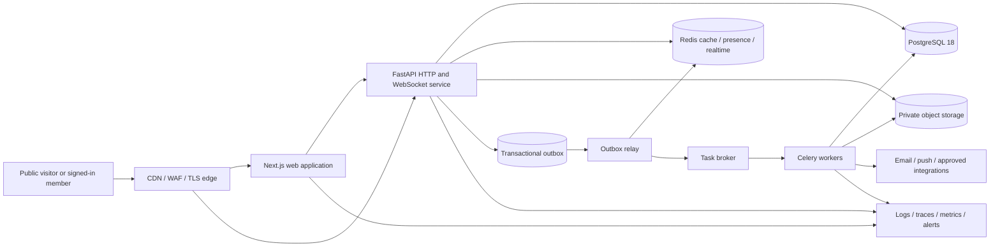
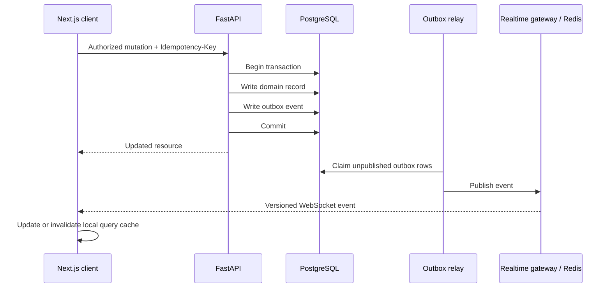
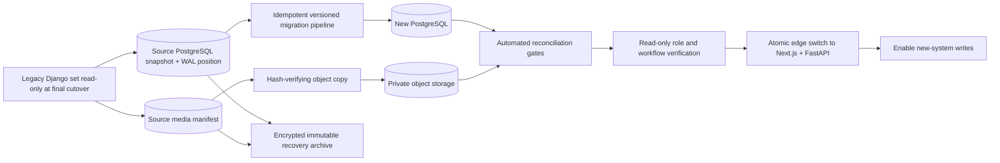

# UG UTAG Portal Modernization Blueprint

- **Document type:** Product scope, solution architecture, delivery plan, and acceptance framework
- **Prepared for:** University of Ghana branch of the University Teachers Association of Ghana (UG UTAG)
- **Prepared on:** 22 July 2026
- **Status:** Engineering baseline implemented; production acceptance and institutional decisions remain where explicitly identified

---

## Document navigation

- [Executive recommendation](#1-executive-recommendation)
- [Full replacement boundary](#11-full-replacement-boundary)
- [Current scope and risks](#3-current-scope-discovered-in-the-codebase)
- [Complete functional scope](#7-complete-functional-scope)
- [Recommended technology stack](#9-recommended-technology-stack)
- [Target system and real-time architecture](#10-target-system-architecture)
- [Security, privacy, and compliance](#15-security-privacy-and-compliance)
- [Data migration and cutover](#20-data-migration-and-cutover-plan)
- [Delivery plan](#21-delivery-plan)
- [Acceptance criteria](#23-product-acceptance-criteria)
- [Complete implementation checklist](#appendix-a-complete-implementation-checklist)

---

## Implementation state

The replacement codebase described by this blueprint now exists under
`apps/web`, `apps/api`, and `ops`. It includes the responsive Next.js portal,
role-aware dashboard, FastAPI domain APIs, PostgreSQL/Alembic data model,
authenticated WebSockets with Redis fan-out, Celery workers and scheduler,
transactional outbox, secure media pipeline, observability, container topology,
CI checks, backup/restore tooling, and a checksum-driven migration system.
Django is excluded from the target runtime and retained only as a read-only
migration source.

Appendix A remains the formal launch and acceptance register. Its boxes are not
automatically checked merely because matching code exists: items that require
production data, University decisions, credentials, provider contracts,
independent testing, named acceptance, rehearsals, or observed service levels
must be signed by their real owner. The executable evidence and exact sequence
are defined in `IMPLEMENTATION_AND_ZERO_LOSS_RUNBOOK.md`.

The zero-loss implementation captures every source table, including Django's
session and migration ledgers. Supported records are promoted into operational
models; every original row is also retained with a checksum and disposition.
Anything left archive-only is listed by the reconciliation report and blocks
cutover until a named data owner explicitly approves it. Every media upload is
verified in object storage after copy. This makes an incomplete mapping visible
and reviewable instead of silently dropping data.

### Implemented replacement capability

| Area | Implemented in the replacement stack |
|---|---|
| Public portal | Responsive V1-aligned home, about, leadership, news, events, gallery, resources, contact, search, public settings, and an accessible manually controlled homepage carousel |
| Identity | Opaque cookie sessions, CSRF protection, invitation/reset flows, forced first-login password replacement, role/permission enforcement, profile editing, and generic authentication errors |
| Member administration | Bounded live directory, search/filter/sort, invite/create/edit, roles and status, safe retained archive, CSV export, and preview-first CSV/XLSX import with duplicate and row-level validation |
| Leadership and organization | Executive appointments, end-of-term action, public visibility, Executive Officers and Local Executive Council presentation, plus school/college/department/committee records |
| Publishing and records | Articles, announcements, events, documents and versions, galleries, media assets, publication states, ETags/version checks where applicable, and retained archive actions |
| Media and homepage | Quarantined uploads, checksum, ClamAV workflow, private/public serving, metadata, ready-state enforcement, media-library image picker, carousel ordering and publication |
| Communications | Live notification inbox and broadcast, direct and group conversations, group roles/membership, message read/delete operations, and WebSocket-driven query reconciliation |
| Commercial and operations | Advert placements, campaigns, plans and orders, overview metrics, audit ledger, feature flags, site settings, background jobs, health checks, and operational containers |
| Data protection | Additive Alembic schema, source-row archive and dispositions, deterministic checksums, media manifest verification, reconciliation gates, backup/restore and cutover scripts |

The local release verification and precise production safeguards are recorded
in `IMPLEMENTATION_AND_ZERO_LOSS_RUNBOOK.md`. Capabilities that depend on an
institutional provider or policy—such as University SSO, administrator MFA
method, email/SMS/push delivery contracts, production hosting, retention
periods, independent penetration testing, and production load evidence—remain
acceptance gates rather than being simulated with false integrations.

---

## 1. Executive recommendation

UG UTAG should replace the current template-driven Django experience with a custom, mobile-first platform made of:

- a single **Next.js 16 / React 19 / TypeScript** frontend containing both the public website and authenticated dashboard;
- a **FastAPI** backend implemented as a domain-organized modular monolith;
- **PostgreSQL** as the authoritative database;
- **Redis** for caching, rate limits, presence, ephemeral real-time signals, and cross-instance WebSocket fan-out;
- **Celery** workers for email, notification fan-out, bulk imports, media processing, scheduled jobs, reports, and other durable background work;
- S3-compatible object storage and a CDN for images, documents, and chat attachments;
- one authenticated WebSocket connection per signed-in browser, with topic subscriptions, resumable event cursors, reconnect handling, and REST reconciliation;
- a transactional outbox so database changes and real-time events cannot silently diverge;
- role- and resource-aware authorization, strong admin authentication, full audit history, privacy controls, automated testing, observability, backups, and staged deployment.

In the target steady state, Django is fully retired from production. It remains available only as a restricted read-only legacy reference during the agreed post-cutover period.

This should be delivered as a **controlled migration**, not a big-bang rewrite. The existing portal already contains valuable data and business behavior. Public content can move first, followed by authentication and the member dashboard, content/document management, real-time messaging, administration, advertising, and final cutover.

A realistic delivery window for the complete scope is **20–26 weeks** with a focused cross-functional team. A smaller two- or three-person team should plan for approximately **7–10 months**. These are planning ranges, not contractual estimates; the discovery and data-profiling phase must validate them.

### 1.1 Full replacement boundary

This is a complete application replacement, not a frontend skin placed over Django. The finished production request path must not depend on Django, Django templates, the Django ORM, Django Admin, Django Channels, Daphne, TinyMCE, Bootstrap, jQuery, DataTables, WhiteNoise, or the old static dashboard/public-site bundles.

The approved target mapping is:

| Legacy production responsibility | Required replacement |
|---|---|
| Django templates and public views | Next.js App Router public experience |
| Django dashboard templates, Bootstrap, and jQuery | Custom Next.js/React dashboard and source-owned design system |
| Django URLs, views, forms, and JSON endpoints | Versioned FastAPI HTTP APIs |
| Django Admin | Purpose-built, permission-aware administration screens in the new dashboard |
| Django models and query logic | SQLAlchemy 2.0 domain models, repositories, and explicit service-layer rules |
| Django migrations | Alembic migrations with reviewed expand/contract deployment behavior |
| Django authentication and sessions | FastAPI-managed opaque sessions, CSRF protection, recovery, MFA, and optional approved SSO |
| Django groups and scattered permission checks | Central RBAC plus resource-attribute policy layer |
| Django Channels and Daphne | FastAPI WebSocket gateway running on the standard ASGI deployment |
| Model signals for business workflows | Explicit application services, transactional outbox events, and idempotent consumers |
| Django-integrated Celery tasks | Framework-independent Celery application and workers |
| Local/volume media serving | Private S3-compatible object storage, signed access, variants, and CDN |
| TinyMCE and stored unrestricted HTML | Schema-constrained editor plus strict server-side sanitization |
| DataTables and template tables | TanStack Table with server pagination, filtering, sorting, and virtualization where measured |
| Template chart scripts | ECharts with accessible summaries and live query-cache integration |
| WhiteNoise/static collection | Next.js asset pipeline and immutable CDN-cached assets |

PostgreSQL, Redis, Celery, Nginx/ingress, and Docker may remain as infrastructure concepts, but they will be upgraded, reconfigured, and owned by the new application. Retaining those products does not mean retaining the Django implementation.

Legacy code may be used only for:

- understanding and characterizing existing behavior;
- repeatable data extraction and reconciliation;
- temporary compatibility verification for password hashes or encrypted chat data;
- restricted read-only support during the approved post-cutover confidence period.

The replacement is complete only when:

- all approved public and dashboard routes are served by Next.js and FastAPI;
- all recurring jobs and WebSocket traffic run through the new services;
- all required data and files are reconciled in the target stores;
- the edge has no production route to a writable Django application;
- the old containers and scheduled jobs are stopped;
- the legacy database account is read-only and then revoked after retention approval;
- Django dependencies, templates, old static bundles, and legacy deployment services are removed from the active production release;
- monitoring shows no traffic or job dependency on the old application during the confidence period.

---

## 2. What was reviewed

This proposal is based on a repository and visual review of the current project, including:

- application routes, models, views, background jobs, WebSocket consumers, configuration, and deployment files;
- public website and dashboard templates and screenshots;
- the member dashboard manual;
- role and permission documentation;
- chat, URL-security, image-optimization, and deployment notes;
- the current Python dependency set and Docker topology.

The current implementation is a Django 4.2 monolith with server-rendered templates, Bootstrap/jQuery-era assets, Django Channels, Redis, Celery, PostgreSQL support, Nginx, and Docker. The repository contains approximately:

- 121 declared HTTP routes across the main applications;
- 96 HTML templates;
- 109 migration files;
- three substantive automated test cases, concentrated in chat;
- public website, account, dashboard, chat, advertising, and gallery applications.

This inventory shows that the project is a working product with meaningful domain complexity. The modernization must preserve behavior and data rather than merely reproduce the visible pages.

---

## 3. Current scope discovered in the codebase

### 3.1 Public website

The public site currently includes:

- home and carousel content;
- about and contact pages;
- current and past executive leadership;
- news listings and detail pages;
- event listings and detail pages;
- photo galleries;
- public advertising placements, impressions, and click redirects;
- search presentation elements;
- authenticated portal entry.

### 3.2 Identity and organization

The current system stores:

- member staff ID, email, title, name, gender, academic rank, phone, and profile image;
- school, college, and department relationships;
- executive positions, appointment dates, end dates, terms, biographies, and social links;
- Django groups and permissions for Admin, Executive, Secretary, and Member behavior;
- forced first-login password changes;
- administrator and member bulk import workflows.

### 3.3 Authenticated dashboard

The current dashboard includes:

- role-specific summary cards;
- recent news, events, announcements, documents, and notifications;
- member and administrator management;
- executive appointment and profile management;
- internal and external document management with group visibility;
- events, news, announcements, galleries, carousel slides, and notifications;
- advertising plans, creatives, orders, impressions, and clicks;
- user profile and password management.

### 3.4 Messaging and real-time behavior

The portal already supports:

- one-to-one conversations;
- group conversations and membership management;
- group administrator privileges and invite links;
- message replies, deletion, read state, delivery state, and attachments;
- server-side encryption of message text and attachments;
- WebSockets for direct chat, group chat, and chat-list updates;
- Redis-backed Django Channels;
- reconnect and heartbeat behavior in the browser.

This existing behavior should be treated as a migration requirement. It should not be reduced to a basic chat box during the rewrite.

### 3.5 Existing operational foundations worth retaining conceptually

The current project already demonstrates useful patterns:

- PostgreSQL production support;
- Redis cache and channel layers;
- Celery workers and periodic tasks;
- Dockerized application, worker, scheduler, Redis, database, and proxy services;
- image resizing, compression, thumbnail generation, and lazy loading;
- encrypted message storage;
- role-sensitive document visibility;
- production-oriented HTTPS and static caching configuration.

The target solution should improve and standardize these ideas rather than discard them.

---

## 4. Current constraints and modernization risks

The following are material engineering concerns to address before or during migration:

1. **Authorization is scattered.** Access decisions are currently expressed through Django permissions, group names, helper methods, executive-position checks, superuser checks, view mixins, and template conditions. These can disagree. The new backend needs one policy layer with automated permission-matrix tests.

2. **CSRF exemptions exist on mutation paths.** Several gallery and utility endpoints are exempted from CSRF protection. Every new state-changing browser request must use the standard CSRF defense or an explicitly reviewed non-cookie authentication flow.

3. **A database environment file is tracked by Git.** `utag_ug_archiver/.env.db` must be removed from version control. If it has ever held real credentials, those credentials must be rotated and repository history must be reviewed by an authorized administrator. Secrets must move to deployment secret storage.

4. **Rich HTML needs explicit sanitization.** Events, news, announcements, and documents contain editable HTML, and at least one notification response marks stored content as safe. The new system must sanitize on write using a strict allowlist and render only sanitized output.

5. **URL tokens are not authorization.** Unpredictable chat URLs reduce enumeration but must never replace participant or group-membership checks. Every HTTP and WebSocket access must authorize the trusted user against the requested resource.

6. **Current chat encryption is not end-to-end encryption.** The server can decrypt messages because conversation keys and ciphertext are available to the application. This is encryption at rest at the application layer. The new product must label it accurately and use envelope encryption with a managed key service. True end-to-end encryption is a separate product and key-recovery decision.

7. **Notification fan-out is synchronous and model-signal driven.** Generating a row for every recipient in a request or model signal will become slow and failure-prone as membership grows. Publication should write an outbox event; workers should create notification deliveries in bounded, idempotent batches.

8. **Automated coverage is too small for a rewrite.** The current repository exposes broad product behavior but has only a few substantive automated tests. A characterization suite must be built before migrating high-risk behavior.

9. **Debug output and inconsistent error handling remain.** Some request paths print application context or internal values. The replacement needs structured, redacted logging and a consistent public error contract.

10. **Existing performance claims are not reproducible baselines.** Documentation contains expected improvements, but the new project should record Lighthouse, Web Vitals, API latency, query, WebSocket, and load-test results in CI or repeatable scripts.

These findings do not mean the current portal should be abandoned immediately. They define the areas that the modernization must deliberately improve.

---

## 5. Product vision

The new portal should be the trusted digital home of UG UTAG: a credible public voice, a secure member workspace, and a live operational view of association activity.

### 5.1 Product principles

1. **Institutional, not generic.** The interface should feel purpose-built for an academic association at the University of Ghana, not like a recolored admin template.
2. **Mobile is a primary context.** Every critical workflow must work well on a narrow phone over an inconsistent mobile connection.
3. **Live where it matters.** New messages, notifications, job progress, publication status, registrations, and dashboard counts should update without manual refresh. Static content should remain cacheable.
4. **Calm information density.** Advanced capability should not become visual clutter. Priority, hierarchy, and progressive disclosure should lead the design.
5. **One source of truth.** A data change is committed once and propagated through durable events; screens reconcile after reconnects.
6. **Accessible by default.** Semantic HTML, keyboard operation, visible focus, sufficient contrast, reduced-motion support, screen-reader labels, and large touch targets are release requirements.
7. **Secure by architecture.** Authentication, authorization, audit, privacy, retention, safe uploads, rate limits, and secret management are designed in, not added before launch.
8. **Measured, operable, and recoverable.** The team needs logs, traces, metrics, alerts, backups, restore drills, and documented runbooks.

### 5.2 Brand continuity and the Association Pulse

The public website is a modernization of the approved V1 UG UTAG identity, not a rebrand. The official combined UTAG and University of Ghana logo, navy/blue/gold palette, authentic University and association photography, institutional navigation, and familiar public-page order are the visual source of truth. Modernization should improve responsiveness, accessibility, performance, content management, and interaction quality while preserving recognition and trust.

The public homepage should retain the V1 content sequence: association-led hero, core commitments, branch welcome, events, gallery, executive leadership, aims, news, and the institutional footer. Any material departure from that identity or information architecture requires explicit stakeholder approval and a reviewed visual prototype.

The recognizable product motif should be an **Association Pulse**: a restrained live activity rail used across the dashboard to show new announcements, event milestones, document publications, chat activity, and administrative job progress. It should use UG navy, UTAG red, and University of Ghana gold as status accents without turning every page into a feed.

On the public site, the same idea becomes a small “Latest from UG UTAG” update strip within the established V1 structure. On the dashboard, it becomes a personalized, permission-aware live activity stream. This creates continuity without imposing a dashboard metaphor on the public website.

---

## 6. Users, roles, and authorization model

### 6.1 Primary user groups

| User group | Primary needs |
|---|---|
| Public visitor | Understand UG UTAG, find leadership, read official news, view events and galleries, locate contact information |
| Member | Receive official information, find documents and events, communicate securely, maintain a profile, search member resources |
| Executive | Member capabilities plus targeted communication, announcements, selected content workflows, and leadership views |
| Secretary | Executive capabilities plus approved document, news, event, and publication responsibilities |
| Content editor | Draft and edit assigned public content without access to member administration |
| Communications officer | Publish news, announcements, campaigns, media, and push/email communications according to approval policy |
| Administrator | Manage members, organization references, roles, content, settings, imports, and operational health |
| Auditor/support officer | Read appropriate audit and support information without broad mutation privileges |
| Super administrator | Emergency and platform administration; tightly limited, MFA-required, and audited |

### 6.2 Target authorization approach

Use a combination of:

- **RBAC** for stable roles and permissions;
- **resource attributes** for rules such as document audience, content ownership, announcement target group, and group-chat membership;
- **explicit policy functions** in the service layer;
- **deny by default** behavior;
- **server-side enforcement** for every HTTP request, file download, background task, and WebSocket subscription;
- **frontend capability responses** only to shape the interface, never to provide security;
- full audit entries for role changes, member status changes, exports, password resets, destructive actions, publication, and security administration.

### 6.3 Permission domains

Permissions should use clear names such as:

- `members.read`, `members.create`, `members.update`, `members.archive`, `members.export`;
- `executives.read`, `executives.manage_terms`, `executives.publish_profile`;
- `documents.read`, `documents.create`, `documents.publish`, `documents.delete`;
- `content.news.publish`, `content.events.publish`, `content.announcements.publish`;
- `communications.send`, `communications.view_delivery_metrics`;
- `chat.create_group`, `chat.moderate_group`;
- `adverts.manage`, `adverts.view_revenue`;
- `audit.read`, `settings.manage`, `roles.manage`.

Roles should be assignments of permissions, not hard-coded branches throughout the application. Secretary privileges should be represented by an assigned role or scoped permission, not string comparison against a job title.

---

## 7. Complete functional scope

### 7.1 Public website

#### Home

- V1-aligned association hero using approved UG UTAG photography and controlled content rather than a heavy rotating banner by default;
- current official statement or priority announcement;
- latest news and press releases;
- upcoming events with date, location, registration state, and calendar action;
- current executive leadership preview;
- Association Pulse strip;
- featured resources or documents explicitly marked public;
- gallery highlight;
- approved advertising placements;
- strong contact and member-login calls to action.

#### About and governance

- association overview, mission, mandate, history, and values;
- relationship to UTAG and the University of Ghana;
- constitution, policies, and public governance documents;
- leadership structure and committee explanations;
- contact channels and office hours managed as content, not hard-coded.

#### Leadership

- current executive officers;
- executive committee members and representatives;
- past executives and term history;
- accessible profile pages with biographies, appointments, portfolios, and approved links;
- automatic distinction between active and past terms.

#### News and statements

- list and article pages;
- categories, tags, author, publication date, update date, citations, and attachments;
- draft, review, scheduled, published, archived, and withdrawn states;
- featured and pinned content;
- social sharing metadata, canonical URLs, structured data, RSS/Atom feed, and printable views;
- server-side sanitization for rich content.

#### Events

- upcoming, ongoing, completed, postponed, and cancelled states;
- in-person, online, and hybrid events;
- schedule, speakers, venue/map, online access rules, registration deadline, capacity, and attachments;
- add-to-calendar downloads and optional authenticated member registration;
- event photo follow-up and post-event resources;
- safe handling of private meeting links so they are never exposed in public API payloads.

#### Gallery and media

- album browsing, captions, dates, credits, alt text, and cover images;
- responsive image variants, modern formats, blur placeholders, and lightbox navigation;
- keyboard and screen-reader support;
- optional video embeds with captions/transcripts.

#### Public resources

- explicitly public documents only;
- category, year, subject, and full-text metadata search;
- accessible preview information and download tracking where appropriate;
- stable URLs and replacement/version notices.

#### Contact

- validated contact form with spam protection and rate limits;
- departmental contact routes where approved;
- acknowledgement email and internal ticket/queue creation;
- privacy notice and consent for submitted personal data;
- no public exposure of private member contact information.

#### Search

- global public search across news, events, leadership, and public resources;
- typo-tolerant suggestions only if a dedicated search service is later justified;
- initially use indexed PostgreSQL full-text search to reduce operational complexity;
- query analytics without storing unnecessary personal data.

#### SEO and discoverability

- server-rendered metadata and content;
- XML sitemap, robots rules, canonical URLs, Open Graph data, and schema.org markup;
- permanent redirects for existing news and event URLs;
- fast, cacheable public pages with on-demand revalidation after publication.

### 7.2 Shared authenticated experience

#### Authentication and account recovery

- email/password sign-in with secure opaque sessions;
- first-login password change where imported accounts require it;
- password reset by short-lived single-use link;
- optional University of Ghana SSO through OIDC or SAML after institutional approval;
- TOTP or passkey MFA, mandatory for administrators and high-privilege executives;
- device/session list and remote sign-out;
- progressive throttling, suspicious-login alerts, and generic account-recovery responses;
- accessible authentication screens and recovery guidance.

#### Dashboard shell

- collapsible desktop navigation and mobile bottom/navigation-drawer pattern;
- command search for navigation and permitted actions;
- global notification center;
- connection indicator only when useful, with “reconnecting” and “data may be stale” states;
- configurable density, dark mode, reduced motion, and saved user preferences;
- breadcrumbs on deep operational screens;
- keyboard shortcuts that never conflict with browser or assistive-technology conventions.

#### Personalized dashboard home

- role-aware key metrics, not the same cards for every user;
- upcoming events and registration state;
- unread notifications and messages;
- recently published or updated documents;
- assignments requiring action, such as content awaiting approval or failed imports;
- Association Pulse live activity feed;
- admin-only operational health and queue summaries;
- time range and organization filters with shareable URL state;
- “last synchronized” time based on client data state, not a decorative server timestamp.

#### Profile and preferences

- personal and academic profile editing;
- department, college, and school display with controlled change workflow if sourced from HR;
- profile and executive image management;
- communication preferences by channel and category;
- privacy controls for directory fields;
- MFA, password, devices, and active sessions;
- data access/correction request entry point.

#### Progressive web and constrained-connectivity behavior

- installable web-app manifest and coherent home-screen identity;
- resilient application shell and clear offline/reconnecting indicators;
- optional encrypted-at-rest browser cache for a small set of explicitly approved recent read-only resources;
- queued retry only for safe, idempotent actions with visible status;
- no offline administrator mutation, chat send, or publication workflow until conflict and device-security policy is explicitly designed;
- browser push only after consent and stakeholder approval.

### 7.3 Member and organization management

- paginated, filterable, sortable member directory;
- server-side search by staff ID, name, email, rank, school, college, department, role, and status;
- create, edit, activate, suspend, archive, and restore workflows;
- individual and bulk role assignment with confirmation and audit;
- CSV/XLSX import with mapping, dry run, validation, duplicate detection, progress, row-level errors, and downloadable results;
- export jobs with permission checks, reason capture, expiring download links, and audit;
- controlled password reset or invitation workflows;
- organization reference-data management;
- member history timeline;
- duplicate merge workflow restricted to administrators;
- no unbounded “load all members” endpoints.

### 7.4 Executive and committee management

- create appointments from existing members;
- record portfolio, dates, terms, acting status, biography, and public visibility;
- prevent conflicting active appointments according to agreed rules;
- distinguish active, outgoing, and past leadership;
- manage executive committees and representatives;
- printable/exportable leadership records;
- scheduled status transition at term end with administrator review;
- public profile preview before publication.

### 7.5 Document and knowledge management

- internal/external/public classification;
- audience policy by role, organization unit, named group, or selected users where justified;
- draft, review, published, archived, superseded, and withdrawn states;
- multiple files per document, file version history, checksum, MIME type, size, uploader, and malware-scan status;
- metadata, sender, receiver, date, tags, references, and rich description;
- full-text metadata search and optional text extraction/OCR for approved file types;
- preview for safe formats, signed downloads for private files, and download audit where necessary;
- bulk upload with safe limits;
- retention and legal-hold fields;
- stable document identifiers and links;
- a clear “you do not have access” response that does not disclose private metadata.

### 7.6 News, events, announcements, and publishing workflow

- unified content editor using source-owned accessible components;
- structured content plus sanitized rich text;
- autosave with explicit saved/saving/error state;
- preview at mobile, tablet, and desktop widths;
- draft → review → approved/scheduled → published lifecycle;
- reviewer comments and revision history;
- optimistic locking or version checks to prevent silent overwrite by two editors;
- scheduled publish/unpublish jobs;
- publication emits cache-invalidation and real-time events;
- announcement targeting by role or organizational scope;
- notification fan-out by worker with delivery tracking;
- public and member-only publication choices.

### 7.7 Notifications and communications

- in-app notification inbox with unread state, category, priority, and deep link;
- live badge/count updates;
- digest and immediate email preferences;
- browser push only after explicit opt-in and stakeholder approval;
- SMS as a later integration if budget and provider governance are approved;
- delivery attempts, provider response, bounce/suppression state, and retry policy;
- announcement notification fan-out in idempotent batches;
- read/unread synchronization across devices;
- quiet-hours and category preferences where appropriate;
- emergency broadcast capability restricted to explicitly approved roles and heavily audited.

### 7.8 Real-time direct and group messaging

- direct conversations and managed groups;
- group creation policy, membership, group administrators, invite links, expiry, and revocation;
- text, reply, safe attachments, edited/deleted markers if editing is approved;
- optimistic send with client-generated idempotency key;
- server acknowledgement, delivered state, and read state;
- typing and presence as ephemeral events;
- durable message history from PostgreSQL;
- cursor pagination for history;
- attachment malware scanning and safe download authorization;
- message/report moderation workflow if required by UG UTAG policy;
- per-user mute and notification controls;
- reconnection that reconciles missed messages from durable storage;
- server-side envelope encryption for message content and attachments;
- accurate product wording: encrypted at rest, not end-to-end encrypted, unless a later E2EE project is approved.

### 7.9 Gallery, carousel/editorial hero, and media library

- centralized media library with reusable assets, rights/credit, focal point, alt text, variants, and usage references;
- drag-to-reorder galleries and home features with keyboard alternative;
- background processing for thumbnails, WebP/AVIF variants, EXIF stripping, and quality optimization;
- media replacement without broken content references;
- unused-asset reporting and retention controls.

### 7.10 Advertising

- placement catalog with desktop/mobile constraints;
- creative upload, safe HTML policy, destination, schedule, priority, and approval;
- plan and order management;
- atomic or asynchronously aggregated impression/click metrics;
- bot filtering and rate controls;
- campaign performance dashboard;
- clear “Advertisement” labeling;
- no arbitrary unsanitized HTML/JavaScript creatives;
- payment processing only as a separate approved integration with a supported provider. Card data must never be stored by the portal.

### 7.11 Analytics, audit, and settings

- audience-safe operational metrics by time period and organization unit;
- member growth/status, content publication, event registration, document activity, notification delivery, and advert performance;
- no metric card without a definition, time range, and data freshness indicator;
- immutable audit log for security and administrative actions;
- audit filters and export restricted to authorized roles;
- feature flags and editable site settings;
- integration settings that reference secrets by identifier, never display secret values;
- health view for administrators without exposing infrastructure internals to ordinary users.

### 7.12 Explicit future options, not part of the initial commitment

The data model can leave room for these, but they should not enter the first delivery unless formally approved:

- membership dues and payment reconciliation;
- elections and secret ballots;
- grievances/case management;
- surveys and formal voting;
- collective bargaining case workspaces;
- a native mobile application;
- AI summarization, semantic search, or chatbot features;
- true end-to-end encrypted messaging.

Each introduces legal, governance, security, or operational requirements beyond the existing portal.

---

## 8. Experience and visual design direction

### 8.1 Public website

The public site should be institutional, recognizable, confident, and spacious. Recommended characteristics:

- UG navy as the primary institutional field;
- University of Ghana gold for editorial emphasis;
- UTAG red as a selective action or urgency accent, not a general background color;
- clean white and restrained cool-neutral page surfaces consistent with the V1 institutional presentation;
- a highly legible sans-serif family for display and interface text, with disciplined weight and scale;
- authentic association photography with consistent crop and credit rules;
- strong headline and date hierarchy for official statements;
- restrained motion that supports orientation and respects `prefers-reduced-motion`;
- no automatic, rapidly rotating hero content.
- no invented logo marks, abstract technology artwork, decorative editorial typography, or unapproved visual rebranding.

### 8.2 Dashboard

The dashboard should feel like a focused operations workspace:

- compact but readable navigation;
- a persistent context bar for date and organization filters on analytical pages;
- configurable cards only where personalization is useful;
- tables with saved filters, column visibility, bulk selection, keyboard support, and server-side pagination;
- charts accompanied by text summaries and accessible tabular alternatives;
- activity timelines for members, documents, content, and jobs;
- visible draft/review/published states;
- clear loading, empty, offline, stale, partial-error, success, and permission-denied states;
- high-risk actions placed behind a confirmation that names the affected record and consequence.

### 8.3 Responsive behavior

Responsive design must be intentional rather than a desktop layout that shrinks:

- **small phone:** 320–479 px, one-column content, bottom-safe actions, filters in a sheet, cards converted to concise rows where helpful;
- **large phone/small tablet:** 480–767 px, one or two columns based on content, touch-first controls;
- **tablet:** 768–1023 px, collapsible navigation, split views only when both panes remain usable;
- **desktop:** 1024–1439 px, standard operational layout;
- **wide desktop:** 1440 px and above, capped reading widths, expanded analytics where density adds value;
- container queries for reusable dashboard modules;
- 44 px minimum touch targets and no interaction that requires hover.

### 8.4 Accessibility

Release target: **WCAG 2.2 AA** for public and authenticated interfaces.

Required practices include:

- semantic landmarks and heading order;
- skip links and visible keyboard focus;
- labels, descriptions, error association, and form summaries;
- adequate contrast in normal, hover, focus, selected, and disabled states;
- alt text workflow in the media library;
- captions/transcripts for published audiovisual content;
- reduced-motion mode;
- screen-reader announcements for live notifications and job completion, without noisy chat spam;
- accessible data-table and chart alternatives;
- automated checks plus manual keyboard, screen-reader, zoom, and high-contrast testing.

---

## 9. Recommended technology stack

Versions below reflect the current stable ecosystem reviewed on 22 July 2026. The project must pin exact versions in lockfiles, use a compatibility spike before production commitment, and apply security updates continuously.

### 9.1 Frontend

| Area | Recommendation | Why |
|---|---|---|
| Framework | Next.js 16.2.x App Router | Server-rendered public content, metadata/SEO, streaming, nested layouts, code splitting, and an interactive dashboard in one application |
| UI runtime | React 19.2.x | Current Next.js-aligned runtime and modern concurrency/interface capabilities |
| Language | TypeScript with strict mode | Safer refactors and generated API types |
| Styling | Tailwind CSS 4.3.x plus CSS custom-property design tokens | Fast custom implementation, container queries, consistent responsive behavior, and source-controlled design decisions |
| Components | Radix primitives and selected source-owned shadcn/ui patterns | Accessible behavior without adopting a generic visual theme or opaque component package |
| Server/client data | Server Components for public/read-heavy views; TanStack Query for authenticated client cache and mutations | Avoids shipping unnecessary JavaScript while supporting live cache updates, optimistic mutations, retries, and invalidation |
| Forms | React Hook Form plus Zod | Performant complex forms and shared client validation; server validation remains authoritative |
| Tables | TanStack Table plus virtualization where datasets justify it | Custom, accessible tables without locking core behavior behind a commercial grid |
| Charts | Apache ECharts with accessible summaries and SVG/Canvas selected by use case | Rich interaction and broad chart capability for the operational dashboard |
| Rich text | Tiptap/ProseMirror with a strict schema | Structured editing, revision-friendly JSON, and a constrained output model |
| Icons | Lucide | Coherent, lightweight icon set |
| Unit/component tests | Vitest, React Testing Library, Storybook where useful | Fast feedback and state coverage |
| End-to-end tests | Playwright plus axe-core | Cross-browser flows and automated accessibility checks |
| Package management | pnpm with a committed lockfile | Reproducible and space-efficient workspace installs |

Next.js 16.2 is the reviewed production line, and the App Router provides Server Components, Suspense, and Server Functions in the official [Next.js App Router documentation](https://nextjs.org/docs/app). Tailwind 4.3 is the current reviewed release in the official [Tailwind release notes](https://tailwindcss.com/blog/tailwindcss-v4-3). The frontend must still verify the supported-browser matrix, especially older campus-managed devices.

### 9.2 Backend

| Area | Recommendation | Why |
|---|---|---|
| Runtime | Python 3.14.x | Current stable Python feature series; use the normal GIL build initially and measure before considering free-threaded operation |
| Web framework | FastAPI 0.139.x | Typed HTTP APIs, OpenAPI, dependency injection, async support, and native WebSocket integration |
| Validation/settings | Pydantic v2 and pydantic-settings | Typed boundary validation and explicit environment configuration |
| ORM | SQLAlchemy 2.0.x async style | Stable modern ORM with explicit sessions and transactions |
| Database migrations | Alembic 1.18.x | SQLAlchemy-native, reviewable schema migrations |
| PostgreSQL driver | psycopg 3 | Modern PostgreSQL driver with sync/async support |
| Database | PostgreSQL 18.x | Durable source of truth, transactions, JSONB, full-text search, materialized views, and strong indexing |
| Cache/realtime support | Redis 8.x supported stable release | Cache, rate limits, presence, ephemeral Pub/Sub, Streams, and WebSocket fan-out |
| Durable background jobs | Celery 5.6.x; RabbitMQ recommended for broker, Redis acceptable for a simpler first deployment | Existing team familiarity, scheduled work, retries, routing, monitoring, and durable task execution |
| Object storage | S3-compatible private buckets plus CDN | Scalable, signed, lifecycle-managed media and document storage |
| Media processing | Pillow/libvips-backed workers, MIME inspection, and ClamAV or managed malware scanning | Safe asynchronous images and attachments |
| API tests | pytest, pytest-asyncio/anyio, HTTPX, Testcontainers | Fast unit tests and production-like integration tests |
| Load tests | k6 or Locust | Repeatable HTTP and WebSocket load scenarios |
| Dependency management | uv with `pyproject.toml` and a committed lockfile | Fast, reproducible Python environments |

As reviewed, FastAPI 0.139.2 is the latest documented patch and FastAPI recommends pinning known-good versions in its [versioning guidance](https://fastapi.tiangolo.com/deployment/versions/). Python 3.14.6 is the current reviewed maintenance release on [Python.org](https://www.python.org/downloads/release/python-3146/). SQLAlchemy 2.0.51 is the current stable 2.0 release in the [official documentation](https://docs.sqlalchemy.org/en/20/); do not begin the project on a beta 2.1 release. PostgreSQL 18 is current and supported through 2030 under the official [PostgreSQL versioning policy](https://www.postgresql.org/support/versioning/). Celery 5.6 is the documented stable line in the [Celery documentation](https://docs.celeryq.dev/en/stable/getting-started/).

### 9.3 Platform and operations

| Area | Recommendation |
|---|---|
| Containerization | Multi-stage Docker images running as non-root users |
| Edge/proxy | Existing Nginx pattern or a managed ingress; TLS, WebSocket upgrade, request limits, and security headers tested explicitly |
| CDN/WAF | Cloudflare or institution-approved equivalent for public assets, rate controls, and edge protection |
| CI/CD | GitHub Actions or institution-approved CI with checks, signed build artifacts, migration gates, staging, and production approval |
| Infrastructure | Terraform for managed cloud; Ansible plus Docker Compose for a controlled single-host/on-prem deployment |
| Observability | OpenTelemetry traces/metrics, structured JSON logs, Sentry or equivalent error tracking, Prometheus/Grafana or managed telemetry |
| Secrets | Deployment secret manager; no credentials in source, images, frontend variables, or logs |
| Backups | Automated PostgreSQL point-in-time recovery, object versioning/lifecycle, encrypted off-site copies, and scheduled restore tests |

---

## 10. Target system architecture



### 10.1 Architectural style

Begin with a **modular monolith**. The FastAPI deployment is one application, but code and database ownership are separated into domains. This gives the team:

- one transactional boundary;
- simpler operations and debugging;
- less network and deployment overhead;
- clear internal contracts;
- the option to extract a service later only when scale or team ownership proves the need.

Do not create separate microservices for members, content, chat, notifications, and adverts in the first version. Real-time behavior does not require microservices.

### 10.2 Backend domains

Recommended modules:

- `identity` — users, credentials, sessions, MFA, invitations;
- `organization` — schools, colleges, departments, committees;
- `access` — roles, permissions, policy evaluation;
- `members` — member lifecycle, imports, exports, directory;
- `executives` — appointments, terms, biographies;
- `content` — news, announcements, pages, revisions, publication;
- `events` — events, speakers, schedule, registration, attendance;
- `documents` — document records, versions, audiences, downloads;
- `media` — assets, variants, scans, metadata;
- `notifications` — in-app, email, push preferences and delivery;
- `chat` — conversations, groups, messages, receipts, attachments;
- `adverts` — slots, plans, campaigns, orders, metrics;
- `analytics` — defined metrics and aggregates;
- `audit` — append-only security and administration events;
- `realtime` — authenticated gateway, subscriptions, cursor/replay bridge;
- `platform` — settings, jobs, health, integrations, feature flags.

### 10.3 Layering inside each domain

Each domain should have:

- API schemas and route handlers;
- application services/use cases;
- policy checks;
- domain models and invariants;
- repository/query functions;
- SQLAlchemy persistence models;
- emitted domain/outbox events;
- focused unit and integration tests.

Route handlers should not contain business rules or long SQL sequences. Database sessions are request-scoped; an `AsyncSession` must not be shared across concurrent tasks. Writes that must agree use a single transaction.

---

## 11. Proposed repository structure

```text
UG-UTAG-Portal/
├── apps/
│   ├── web/                     # Next.js public site and dashboard
│   └── api/                     # FastAPI modular monolith
├── packages/
│   ├── api-client/              # generated TypeScript client and types
│   ├── design-system/           # tokens and source-owned components
│   ├── eslint-config/
│   └── typescript-config/
├── infra/
│   ├── docker/
│   ├── terraform/               # if using managed cloud
│   ├── ansible/                 # if using controlled VM/on-prem
│   └── monitoring/
├── scripts/
│   ├── data-migration/
│   ├── reconciliation/
│   └── load-testing/
├── docs/
│   ├── architecture/
│   ├── product/
│   ├── runbooks/
│   └── adr/                     # architecture decision records
├── docker-compose.yml
├── Makefile or taskfile.yml
└── README.md
```

The current Django system should remain in a clearly named legacy directory or maintenance branch during migration. New and legacy applications should not be interleaved file by file.

---

## 12. API design

### 12.1 General conventions

- Base path: `/api/v1`.
- JSON uses stable `snake_case` or `camelCase`; choose once and generate clients accordingly.
- External resource identifiers use UUIDv7 generated application-side. Preserve old integer keys in a `legacy_id` column during migration.
- Collection endpoints use cursor pagination for changing feeds and bounded page pagination where admin tables require page counts.
- Filter and sort fields are allowlisted.
- Mutations return the updated resource representation or a job resource.
- Every response includes a request/correlation ID header.
- Errors use one documented envelope with machine-readable code, safe message, field errors, and request ID.
- Retried create/action requests accept an `Idempotency-Key` and store a bounded result record.
- Optimistic concurrency uses a version field or `If-Match`/ETag for high-contention editors.
- OpenAPI is the contract; CI generates and type-checks the frontend client.
- Sensitive fields use separate response schemas and are never returned merely because they exist on the database model.

### 12.2 Endpoint groups

```text
/api/v1/auth/*
/api/v1/me/*
/api/v1/members/*
/api/v1/organization/*
/api/v1/roles/*
/api/v1/executives/*
/api/v1/news/*
/api/v1/announcements/*
/api/v1/events/*
/api/v1/documents/*
/api/v1/media/*
/api/v1/notifications/*
/api/v1/conversations/*
/api/v1/chat-groups/*
/api/v1/adverts/*
/api/v1/analytics/*
/api/v1/audit-events/*
/api/v1/jobs/*
/api/v1/settings/*
/api/v1/search
/api/v1/health/live
/api/v1/health/ready
```

### 12.3 File upload sequence

1. Client requests an upload intent with filename, size, and declared type.
2. Backend authorizes the intended use and returns a short-lived signed upload or controlled multipart endpoint.
3. Object lands in a quarantine prefix.
4. Worker verifies actual MIME/signature, size, image safety, and malware status; strips unwanted metadata and creates variants where relevant.
5. A media record transitions to `ready` or `rejected`.
6. The user receives live job progress and a durable notification on completion/failure.
7. Private downloads use short-lived signed URLs only after a fresh authorization decision.

Never trust filename extensions or client MIME types. Do not serve quarantined uploads from an executable origin.

---

## 13. Real-time architecture

### 13.1 What “live data across all pages” should mean

The signed-in application should have one shared real-time client. Pages subscribe only to the topics they need. WebSockets should push **change events**, not continuously resend entire dashboards.

Examples:

- a new announcement pushes `announcement.published` and `notification.created`;
- the dashboard invalidates the announcement list and relevant metric query;
- the notifications panel inserts the new notification from its event payload;
- a member-management import receives `job.progress` events;
- chat messages use dedicated conversation topics;
- after reconnect, the browser asks REST endpoints for authoritative current state.

Public pages should primarily use caching and on-demand revalidation. They do not require an always-open socket simply to appear modern.

### 13.2 Connection protocol

- Endpoint: `/api/v1/realtime`.
- Authenticate with the normal secure session cookie.
- Validate the WebSocket `Origin` allowlist.
- Re-evaluate authorization when a client subscribes to a topic.
- Send a `hello` frame containing connection ID, heartbeat interval, server time, and current event cursor.
- Support `subscribe`, `unsubscribe`, `ack`, `ping`, and `pong` frames.
- Use versioned event envelopes.
- Apply maximum message size, subscription count, per-user connection limit, and inbound rate limits.
- Close with meaningful application codes that do not reveal private resource existence.
- Use exponential backoff with jitter on reconnect.
- Pause/reduce work for background tabs without breaking delivery reconciliation.

Example event envelope:

```json
{
  "version": 1,
  "event_id": "019b...",
  "cursor": "173947-0",
  "type": "notification.created",
  "occurred_at": "2026-07-22T14:30:00Z",
  "topic": "user:019a...:notifications",
  "resource": {"type": "notification", "id": "019b..."},
  "data": {"title": "New announcement", "priority": "normal"}
}
```

### 13.3 Topic examples

| Topic | Authorized audience | Typical events |
|---|---|---|
| `user:{id}:notifications` | That user only | notification created/read/deleted |
| `user:{id}:jobs` | Job owner or permitted administrator | queued/progress/completed/failed |
| `conversation:{id}` | Current participants | message created, delivered, read, deleted |
| `chat_group:{id}` | Current group members | message and membership events |
| `dashboard:{role_or_scope}` | Users authorized for that metric scope | metric invalidation/change |
| `content:publications` | Authenticated users, payload filtered | newly published member content |
| `admin:members` | Member administrators | member/import changes without unnecessary PII |

Topic names are server-derived. The client cannot obtain data simply by guessing a topic string.

### 13.4 Reliable event flow



Redis Pub/Sub is useful for fast fan-out but has at-most-once delivery: disconnected subscribers miss events. The official [Redis Pub/Sub documentation](https://redis.io/docs/latest/develop/pubsub/) explicitly recommends Streams when persistence or stronger delivery is required. Therefore:

- PostgreSQL records remain authoritative;
- the outbox provides commit consistency;
- Redis Pub/Sub may fan out ephemeral presence/typing and low-risk invalidations;
- Redis Streams or an outbox-event table provides a bounded replay cursor for reconnect;
- the client performs REST reconciliation after any cursor gap.

### 13.5 Chat-specific correctness

- The client creates `client_message_id` before optimistic display.
- A unique constraint on `(sender_id, client_message_id)` makes retries idempotent.
- Server responds with canonical message ID and timestamp.
- Message order uses server sequence/cursor, not client clock.
- Delivery/read receipts are idempotent and permission checked.
- Presence and typing indicators may be lost without consequence; messages and receipts may not.
- Slow consumers have bounded queues; the server asks them to resynchronize rather than growing memory indefinitely.
- Attachments become visible only after scan completion.

### 13.6 Fallback behavior

If WebSockets are blocked:

1. use Server-Sent Events for one-way dashboard/notification updates where infrastructure permits;
2. otherwise use adaptive polling with ETag/`updated_since` queries;
3. always keep mutations and durable reads on HTTP;
4. show an unobtrusive stale/reconnect status when the user could otherwise make a wrong decision.

---

## 14. Data architecture

### 14.1 Core entity groups

| Domain | Principal tables/entities |
|---|---|
| Identity | users, credentials, sessions, mfa_factors, password_reset_tokens, login_events |
| Organization | schools, colleges, departments, committees, committee_memberships |
| Access | roles, permissions, role_permissions, user_role_assignments |
| Members | member_profiles, member_status_history, import_jobs, import_rows, export_jobs |
| Executives | executive_appointments, executive_terms, executive_profiles |
| Content | pages, news_articles, announcements, content_revisions, tags, citations, publication_jobs |
| Events | events, speakers, event_speakers, schedule_items, event_documents, registrations, attendance |
| Documents | documents, document_versions, document_files, document_audiences, download_events |
| Media | media_assets, media_variants, malware_scans, media_usages |
| Notifications | notifications, notification_deliveries, communication_preferences, push_subscriptions |
| Chat | conversations, conversation_members, messages, message_receipts, attachments, group_invites |
| Advertising | ad_slots, plans, campaigns, creatives, orders, impression_aggregates, click_events |
| Platform | audit_events, outbox_events, idempotency_records, background_jobs, feature_flags, settings |

### 14.2 Data modeling rules

- Use UUIDv7 external IDs and keep legacy IDs for reconciliation.
- Store timestamps in UTC; render in `Africa/Accra` by product policy.
- Use database constraints for uniqueness, valid ranges, and critical invariants.
- Use foreign keys and explicit delete policies.
- Prefer archival/status transitions for business records; hard deletion is exceptional.
- Use partial and composite indexes derived from real query patterns.
- Keep mutable profile data separate from immutable audit/security history.
- Define personally identifiable information (PII) fields and prevent them from entering general logs or analytics events.
- Use materialized views or aggregate tables for expensive dashboard time series; refresh incrementally or on a schedule.
- Start with PostgreSQL full-text search. Introduce OpenSearch/Meilisearch only after measured search requirements justify another system.

### 14.3 Audit event requirements

An audit event should include:

- event ID and UTC time;
- trusted actor user/session;
- action and resource type/ID;
- permitted organization scope;
- before/after summary or changed field names, with sensitive values redacted;
- request ID, source IP classification, and user agent where lawful and useful;
- reason field for sensitive exports, overrides, or resets;
- success/failure outcome;
- retention classification.

Audit logs must not become a second store of passwords, tokens, message bodies, file contents, or unnecessary PII.

---

## 15. Security, privacy, and compliance

### 15.1 Authentication

Recommended browser authentication is a random opaque session ID in a cookie configured with:

- `HttpOnly`;
- `Secure`;
- `SameSite=Lax` or stricter after flow testing;
- narrow domain/path scope;
- rotation at login, privilege change, password change, and MFA completion;
- server-side revocation and idle/absolute expiry.

Do not store long-lived access or refresh tokens in `localStorage`. If native/mobile/API clients are introduced later, use a separate reviewed OAuth/OIDC flow.

Passwords should use Argon2id with current measured parameters. Imported Django PBKDF2 hashes can be verified through a temporary compatibility verifier, then rehashed to Argon2id at successful login. Accounts with unusable or weak legacy credentials should use a secure reset/invitation flow rather than reusing staff ID as a standing password.

### 15.2 Authorization

- Authorize every record read and mutation in the backend.
- Re-authorize private downloads at download time.
- Authorize WebSocket connection, each subscription, and message action.
- Prevent cross-user cache leakage by including identity/scope in private cache keys and never CDN-cache private responses.
- Use uniform 404/403 behavior where resource-existence disclosure matters.
- Add automated tests for every role × action × resource-scope combination.

### 15.3 Browser and API defenses

- CSRF tokens for cookie-authenticated mutations;
- strict CORS allowlist; no wildcard credentials;
- Content Security Policy with nonces/hashes and no unsafe arbitrary ad scripts;
- HSTS, frame-ancestor restrictions, MIME sniffing prevention, referrer policy, and permissions policy;
- request and upload size limits at edge and application;
- rate limits for login, reset, search, contact, invite, export, upload, and chat actions;
- input validation at every boundary;
- rich-text allowlist sanitization;
- parameterized SQL through SQLAlchemy;
- generic external errors and detailed internal structured events;
- dependency, container, secret, and static-analysis scanning in CI.

### 15.4 File safety

- quarantine before publication;
- actual file signature/MIME validation;
- extension allowlist by workflow;
- malware scan;
- decompression-bomb and image-dimension protection;
- PDF and document preview isolation;
- random object keys, never user filenames as storage paths;
- private bucket by default;
- signed upload/download expiry;
- content disposition on unsafe preview types;
- retention and orphan cleanup jobs.

### 15.5 Encryption and keys

- TLS for every network path, including database/Redis when off-host;
- encrypted database disks, backups, and object storage;
- envelope encryption for especially sensitive application fields and chat attachments;
- data-encryption keys wrapped by a KMS/HSM-managed master key;
- key version stored with ciphertext;
- planned rotation and audited decryption operations;
- no encryption key in the same table/record as untrusted ciphertext if it can be avoided;
- no claim of E2EE unless clients exclusively control message keys and recovery behavior is designed accordingly.

### 15.6 Ghana data protection obligations

UG UTAG will process member identity, employment/academic affiliation, contact, communication, and activity data. The solution must be reviewed against Ghana’s **Data Protection Act, 2012 (Act 843)** and current guidance from the Data Protection Commission. The Commission identifies accountability, lawfulness, purpose specification, data quality, openness, security safeguards, and data-subject participation as core principles in its [official compliance guidance](https://dataprotection.org.gh/compliance/).

Before launch, UG UTAG should obtain qualified legal/privacy review for:

- controller/processor responsibilities and registration status;
- published privacy notices and lawful purposes;
- fields collected and retention periods;
- member access, correction, objection, and deletion/archival procedures;
- international/third-party hosting and subprocessors;
- breach response and reporting;
- analytics, advertising, email, push, and optional SMS consent;
- staff access and confidentiality;
- chat and audit retention.

This document is an engineering plan, not legal advice.

---

## 16. Performance and reliability targets

Targets must be validated in staging with realistic Ghanaian mobile conditions and production-like data.

### 16.1 Web experience targets

| Measure | Target |
|---|---|
| Public LCP at p75 | ≤ 2.5 s on tested mid-tier mobile/4G profile |
| INP at p75 | ≤ 200 ms |
| CLS at p75 | ≤ 0.1 |
| Public initial JavaScript | Route-specific budget; aim ≤ 170 KB compressed for common public pages |
| Dashboard route JavaScript | Lazy-load charts/editors; set and enforce per-route budgets during implementation |
| Responsive images | Correct `sizes`, modern variants, reserved dimensions, lazy loading below fold |
| Accessibility | WCAG 2.2 AA acceptance with automated and manual evidence |

### 16.2 API and real-time targets

| Measure | Initial target |
|---|---|
| Cached/public read API p95 | ≤ 200 ms at application edge, excluding large downloads |
| Normal authenticated read p95 | ≤ 300 ms |
| Normal mutation p95 | ≤ 500 ms, excluding asynchronous work |
| WebSocket event fan-out p95 | ≤ 1 s from committed outbox event to connected authorized client |
| Chat send acknowledgement p95 | ≤ 800 ms under planned load |
| Error rate | < 1% for valid application requests; alert thresholds defined per endpoint |
| Availability | 99.9% monthly target after stabilization, excluding agreed maintenance |
| Background job visibility | queued/progress/failure state available for user-visible jobs |

### 16.3 Recovery targets

- proposed database RPO: 15 minutes or better;
- proposed service RTO: 2 hours or better;
- object storage versioning/lifecycle enabled for critical documents;
- encrypted backups separated from the primary host/account where possible;
- quarterly restore rehearsal and documented evidence;
- deployment rollback that does not require a down-migration after destructive schema change.

RPO/RTO must be approved by stakeholders and matched to hosting budget.

### 16.4 Scalability rules

- all collections bounded and paginated;
- avoid N+1 queries through explicit eager loading and query tests;
- database connection pools sized to total process count;
- horizontal API/WebSocket nodes use Redis for fan-out and shared presence;
- background jobs use bounded batches and idempotent retries;
- large exports, imports, media processing, and notification fan-out never block request workers;
- dashboard aggregates are precomputed when live queries become expensive;
- load-test the expected peak and at least 2× safety scenario before launch.

---

## 17. Observability and operations

### 17.1 Logs

- structured JSON with time, level, service, environment, request ID, trace ID, route name, safe actor ID, and error code;
- no passwords, session IDs, reset/invite tokens, authorization headers, message bodies, file contents, or unnecessary PII;
- centralized retention with access control;
- sampled noisy events and full security/audit events according to policy.

### 17.2 Metrics

- request rate, latency, and errors by route;
- database pool, slow queries, locks, and replication/backup health;
- Redis memory, connections, evictions, Stream lag, and Pub/Sub/WebSocket counts;
- Celery queue depth, job age, duration, retries, and failures;
- WebSocket connects, disconnect causes, reconnects, subscription rejection, and slow consumers;
- publication, notification delivery, email bounce, import/export, scan, and media processing outcomes;
- Core Web Vitals from privacy-conscious real-user monitoring.

### 17.3 Traces and errors

- OpenTelemetry context from edge/API through database, Redis, and workers;
- error grouping with release/environment tags;
- source maps protected and uploaded to the error service;
- alert links to runbooks;
- production debugging through traces/logs, not ad hoc `print` statements.

### 17.4 Initial alerts

- API error or latency burn-rate;
- database unavailable or storage nearly full;
- backup or restore verification failure;
- job queue age above threshold;
- notification provider failure spike;
- malware-scanner unavailable;
- WebSocket disconnect/reconnect spike;
- certificate expiry;
- repeated privileged login failures;
- outbox relay lag.

---

## 18. Testing and quality strategy

### 18.1 Before the rewrite

Create characterization tests for the current critical behavior:

- login and forced password change;
- role landing and route access;
- member create/update/import/reset;
- document visibility;
- announcement targeting and notification creation;
- news/event public publication rules;
- executive appointment behavior;
- direct/group chat membership, message, receipt, invite, and attachment authorization;
- advert scheduling/click/impression behavior.

These tests become the migration contract.

### 18.2 Backend tests

- domain unit tests for invariants and policies;
- API integration tests with real PostgreSQL and Redis containers;
- policy matrix tests for roles, resource ownership, audience, and organization scope;
- transaction/outbox atomicity tests;
- idempotency and retry tests;
- migration upgrade tests from a production-shaped anonymized snapshot;
- file validation and malicious upload cases;
- background job retry, duplicate, timeout, and partial-failure tests;
- WebSocket authentication, subscription authorization, ordering, reconnect, cursor gap, and backpressure tests;
- OpenAPI breaking-change checks.

### 18.3 Frontend tests

- component behavior and all interface states;
- keyboard/focus tests for dialogs, menus, tables, command search, rich text, and uploads;
- API cache invalidation and optimistic rollback tests;
- responsive visual regression at representative phone, tablet, desktop, and wide widths;
- end-to-end journeys per role;
- WebSocket reconnect and stale-state behavior;
- Playwright accessibility scans plus manual tests. The [Playwright accessibility guidance](https://playwright.dev/docs/next/accessibility-testing) correctly notes that automation catches only part of accessibility, so manual and inclusive testing remain required.

### 18.4 Non-functional tests

- HTTP load tests for public traffic, login bursts, dashboard reads, search, and downloads;
- WebSocket connection ramp, fan-out, chat, and reconnect storm tests;
- bulk import/export and notification fan-out soak tests;
- database query plan review for high-volume endpoints;
- security review and penetration test before production;
- backup restore and disaster-recovery exercise;
- browser/device testing on current Chrome, Firefox, Safari, Edge, iOS Safari, and Android Chrome plus institution-required older versions.

### 18.5 CI quality gates

- format, lint, and strict type checks;
- unit and integration tests;
- database migration apply/check;
- generated client up to date;
- dependency and secret scanning;
- container scan and software bill of materials;
- production frontend build and bundle-budget check;
- critical end-to-end smoke flows;
- no direct production deployment when required gates fail.

---

## 19. Deployment profiles

### 19.1 Recommended managed production profile

- CDN/WAF/TLS edge;
- two or more Next.js instances;
- two or more FastAPI instances handling HTTP and WebSockets;
- separate Celery workers by queue (`default`, `communications`, `media`, `imports`);
- one scheduler instance with leader/singleton control;
- managed PostgreSQL 18 with automated backups and point-in-time recovery;
- managed Redis supported release;
- RabbitMQ managed or replicated if used as Celery broker;
- private S3-compatible object storage and CDN;
- centralized logs, traces, metrics, errors, and alerts.

This profile reduces database and backup operations risk.

### 19.2 Controlled single-host/on-prem first profile

If institutional hosting requires a VM:

- Docker Compose with separate web, API, WebSocket/API replica, worker, scheduler, PostgreSQL, Redis, broker, and Nginx services;
- database and object/media storage on dedicated persistent volumes with off-host backup;
- strict host firewall and SSH administration controls;
- automatic security updates in a tested maintenance window;
- external uptime and certificate monitoring;
- documented capacity ceiling and migration path to managed/horizontal infrastructure.

This is cost-efficient but has a larger single-host failure domain. It should not be described as highly available.

### 19.3 Environments

- **local:** seeded synthetic data, local object store, email sink;
- **CI:** ephemeral PostgreSQL/Redis/broker, no external production provider;
- **staging:** production-like topology and anonymized/synthetic scale data;
- **production:** separate account/project, keys, domains, storage, and telemetry.

Never share a database or object bucket between environments.

### 19.4 Release method

- trunk-based development or short-lived branches;
- preview builds for UI review;
- immutable versioned images;
- migrations reviewed separately and tested on a snapshot;
- expand/contract schema changes for zero/low-downtime compatibility;
- staging smoke and migration checks;
- production approval and canary/rolling release;
- post-deploy synthetic checks;
- feature flags for incomplete or high-risk workflows;
- documented rollback to prior application version while forward-compatible schema remains.

---

## 20. Data migration and cutover plan

### 20.1 Non-negotiable zero-data-loss contract

Zero data loss is a production release gate. The migration is not accepted merely because the new screens appear correct.

For this project, “no data loss” means:

- every source database row is represented by a target record, an explicitly linked merge, or an encrypted read-only legacy archive entry;
- no invalid, duplicate, unsupported, or orphaned source row is silently discarded—exceptions go to a quarantined migration table/report with the original source payload and reason;
- all relationships, audience rules, group memberships, executive terms, ownership, authorship, status, and historically relevant timestamps are preserved or covered by a signed transformation rule;
- every media object, document, gallery image, profile image, advert creative, news/event attachment, and chat attachment is copied and verified by cryptographic hash;
- all required direct/group messages, membership, replies, receipts, delivery state, and encryption metadata remain recoverable and decryptable by the approved target process;
- existing password hashes are either supported for one-time upgrade, or the affected user receives a controlled reset path; no account disappears;
- all committed writes before the declared cutover point exist in the target system;
- no write can be accepted by both systems without a single declared source of truth and reconciliation path;
- the source database, source media, migration manifests, target pre-launch snapshot, and reconciliation reports are retained according to the approved recovery schedule;
- a tested restore—not only a backup job—is available before routing production traffic;
- record counts, relationship counts, aggregate totals, hashes, access-policy comparisons, and domain-specific semantic checks have zero unexplained critical differences.

If a source item should not appear in the active new product because of privacy, retention, malware, corruption, or business rules, it is preserved in the restricted migration archive until an authorized retention/deletion decision is recorded. Migration code must never turn a product decision into silent deletion.

### 20.2 Migration ownership principle

Do not let Django and FastAPI freely write the same business tables. During coexistence, each domain has exactly one declared write owner. Use read adapters, snapshot/delta ETL, or approved change-data capture until ownership changes.

The default and safest production cutover includes a controlled maintenance window and short write freeze. The project guarantees preservation of data, not an unapproved promise of zero downtime.

If uninterrupted business writes become a formal requirement, add PostgreSQL logical decoding/change-data capture into a migration staging stream, prove deterministic transformations and idempotent consumption, reduce replication lag to zero, and still use a brief final consistency fence before ownership switches. Application-level ad hoc dual writing is not allowed.

### 20.3 Production migration topology



### 20.4 Phase A: inventory, profile, and map

- create an authorized production schema and data inventory without placing raw member data in developer workstations;
- count rows, relationships, distinct statuses, and storage objects per model/domain;
- find duplicate emails/staff IDs, missing organization references, orphaned files, invalid group names, invalid dates, and malformed rich text;
- record object/file paths, size, MIME/signature, and SHA-256 hash;
- map every Django model, historical table, permission, group, route, and job to a target entity, archive, redirect, or signed deprecation decision;
- classify PII and special-risk content before extracting it;
- record current URLs requiring 301 redirects;
- document all password hash algorithms and chat encryption key/ciphertext formats;
- establish source high-water marks and identify tables without reliable `updated_at` columns;
- produce a versioned, signed migration mapping, exception register, and data-retention map.

### 20.5 Phase B: build repeatable versioned ETL

- extract from a consistent database snapshot in stable primary-key batches;
- transform names, enums, titles, roles, audiences, timestamps, and rich content through version-controlled functions;
- sanitize rich HTML while preserving the original in a restricted archive for authorized reconciliation;
- load target records with `legacy_id`, migration batch ID, source-table name, and transformation version;
- keep a durable source-to-target ID map;
- hash and copy media to object storage without deleting the source;
- record every rejected/quarantined row with reason and original identifier;
- make extraction, transformation, load, and file copy idempotent and restartable;
- use database transactions per bounded batch;
- prevent duplicate loads with unique migration keys;
- produce machine-readable and human-readable reconciliation reports after every run;
- run against restored snapshots until the final authorized production execution.

### 20.6 Mandatory rehearsal program

- complete at least three full production-shaped migration rehearsals;
- perform rehearsals from a restored database backup and copied media manifest, not an informal developer database;
- measure extraction, transformation, file-copy, reconciliation, indexing, and smoke-test durations;
- deliberately interrupt and resume the ETL to prove restart safety;
- deliberately rerun completed batches to prove idempotency;
- test duplicate, missing-file, invalid-HTML, expired-token, and undecryptable-chat exception handling;
- run representative authorization comparisons between legacy and target users;
- obtain product/data-owner sign-off on every transformation exception;
- use rehearsal timing to define the production maintenance window with contingency.

### 20.7 Identity migration

- preserve every user and unique source identifier;
- resolve duplicate email/staff ID conflicts through a signed mapping while preserving all source records in the archive;
- support current Django PBKDF2 password hashes temporarily in a narrowly scoped compatibility verifier;
- rehash to Argon2id immediately after successful login;
- invalidate every old web session at cutover;
- require a controlled reset for accounts that used staff ID as password, have unusable hashes, or fail policy;
- migrate roles through the approved permission mapping, not literal group-name assumptions;
- verify representative users against every protected resource class;
- require MFA enrollment for privileged accounts before production administration is enabled.

### 20.8 Content, document, event, advert, and organization migration

- preserve stable public slugs where safe;
- resolve duplicate/invalid slugs and generate a complete 301 redirect table;
- migrate revisions, citations, attachments, speakers, schedules, tags, audiences, attribution, advert schedules, plans, and metrics;
- convert stored HTML into the approved editor schema and sanitized rendered output;
- preserve original created/updated dates and authors where reliable;
- classify every private document before it can be downloaded;
- never publish a file that fails scan or lacks a target access classification;
- retain historical executive appointments, terms, and organization relationships;
- reconcile advert click/impression aggregates separately from active campaign configuration.

### 20.9 Chat and encrypted attachment migration

Chat is the highest-risk migration domain:

- preserve participant and group membership before importing messages;
- inventory all thread/group keys, messages, replies, receipts, delivery records, invites, and attachment objects;
- use one approved process: retain a narrowly scoped legacy decrypt compatibility path, or decrypt and re-encrypt to KMS-backed envelope keys in an isolated audited worker;
- never log plaintext, unwrapped keys, tokens, or attachment contents;
- hash-verify every attachment and thumbnail;
- revoke or migrate invite/access tokens according to the approved security policy;
- validate total and per-conversation message counts, first/last timestamps, membership, reply links, receipt counts, and decryptability;
- quarantine a conversation on any key/decryption discrepancy rather than skipping messages;
- perform a mandatory final chat write freeze and delta pass, even if other low-risk domains use change-data capture.

### 20.10 File and object migration

- produce a source manifest containing source key/path, byte size, SHA-256, owning record, visibility, and content type;
- copy into non-public quarantine/object prefixes first;
- verify target size and SHA-256 before marking an asset migrated;
- scan and process copies without modifying source objects;
- generate target variants independently; the original remains retained according to policy;
- report missing source files as blocking exceptions for private/core documents and chat;
- enable object versioning and deletion protection during migration and the confidence period;
- run a final no-delete synchronization after the source application becomes read-only.

### 20.11 Automated reconciliation evidence

For every domain, produce and archive:

- source and target row counts;
- counts by state, role, audience, organization, and publication status;
- primary/foreign-key and orphan reports;
- source-to-target ID coverage;
- deterministic field-level comparisons or hashes for every record where practical;
- file count, total bytes, and SHA-256 comparison;
- permission outcomes for representative role/resource combinations;
- chat membership, message, receipt, reply, attachment, and decryptability comparisons;
- password compatibility/reset disposition counts;
- redirect coverage for existing public URLs;
- rejected, quarantined, merged, archived, and manually corrected record reports;
- signed product owner, data owner, security lead, and technical lead approval.

### 20.12 Production cutover runbook

1. Complete the final migration rehearsal and close all blocking discrepancies.
2. Announce the approved maintenance window, support channel, and expected read-only period.
3. Confirm source database point-in-time recovery, source media backup, target pre-migration snapshot, object versioning, and restoration evidence.
4. Verify the exact source and target identifiers—never use an ambiguous environment variable, wildcard, or broad filesystem path for migration operations.
5. Deploy the new stack in production dark mode with public access disabled.
6. Apply reviewed Alembic expand migrations through one controlled migration job.
7. Run the full base migration and reconciliation while Django remains the only write owner.
8. At the declared cutoff, place Django into maintenance/read-only mode at both application and database-role levels.
9. Stop legacy Celery workers, scheduler, WebSocket consumers, imports, notification fan-out, and every other source writer.
10. Record cutoff UTC time, database snapshot/WAL position, row high-water marks, and source media manifest version.
11. Run the final delta ETL; fully re-extract tables without reliable update markers.
12. Run the final no-delete media/object synchronization and hash verification.
13. Run every automated reconciliation gate and require zero unexplained blocking difference.
14. Start the new API, workers, scheduler, and WebSocket gateway with external writes still disabled.
15. Run database/file health checks and role-based read-only synthetic journeys.
16. Test migrated password verification/reset, private document authorization, announcement audiences, executive data, and representative chat decryptability.
17. Take a target post-migration/pre-write snapshot.
18. Atomically switch edge routing to Next.js/FastAPI while the new application remains read-only.
19. Run public, Member, Executive, Secretary, and Admin acceptance journeys against the production route.
20. If every go/no-go gate passes, enable new-system writes; FastAPI becomes the sole write owner.
21. Observe error rate, latency, database, queue, outbox, WebSocket, storage, email, and authorization metrics continuously during hypercare.
22. Keep Django and its database restricted and read-only for the approved confidence period; do not run old jobs.

### 20.13 Go/no-go gates

Production writes must not be enabled unless all of these are true:

- source database and media backups exist and a restore has been demonstrated;
- the migration pipeline version matches the approved rehearsal version;
- all target schema migrations are at the expected Alembic head;
- source and target reconciliation has zero unexplained blocking discrepancy;
- every required source row has a target/merge/quarantine/archive disposition;
- all core/private file hashes match;
- chat decryptability and count gates pass;
- permission comparison gates pass;
- role-based production smoke tests pass;
- outbox, workers, WebSockets, email, storage, and monitoring are healthy;
- no old writer or scheduled job remains active;
- product owner, data owner, security lead, and technical lead record approval.

Any failed blocking gate keeps both applications read-only while the issue is corrected or the cutover is aborted.

### 20.14 Rollback without losing post-cutover writes

There are two rollback boundaries:

- **Before new writes are enabled:** edge routing may return to read-only Django after the target is stopped and the source remains unchanged.
- **After new writes are enabled:** do not simply route users back to Django. That would strand or overwrite new FastAPI-era records. Freeze target writes, preserve the target database/WAL and object manifest, then either fix forward or run a tested reverse-delta procedure before any legacy write capability is restored.

The default after write enablement is **fix forward**. A reverse-delta path is implemented only if the business requires rollback to a writable legacy system and the rehearsal proves every target-domain transformation can safely reverse. All target write APIs use idempotency where repetition is possible so retry/fix-forward operations do not duplicate records.

### 20.15 Safe production deployments after migration

Zero data loss applies to every later deployment, not only the Django replacement cutover:

- use expand → backfill → switch code → contract across separate releases for destructive schema evolution;
- never drop/rename a live column or table in the same release that stops reading it;
- add nullable columns first, backfill in bounded resumable batches, then add constraints after verification;
- create large PostgreSQL indexes concurrently where safe and account for operations that cannot run inside a transaction;
- run Alembic once through a dedicated deployment job, never independently in every API replica;
- take/verify the scheduled backup and confirm PITR health before high-risk migrations;
- make background migrations checkpointed and idempotent;
- keep old application versions schema-compatible during rolling/canary deployment;
- deploy immutable images and record application, migration, and configuration versions;
- drain requests and WebSockets gracefully before stopping old replicas;
- use outbox/idempotency rules so worker retries cannot lose or duplicate committed work;
- enable object versioning and avoid destructive media cleanup in a feature deployment;
- run pre-deploy and post-deploy data invariants, smoke tests, and telemetry checks;
- stop the rollout automatically on migration, error-rate, latency, queue, or reconciliation failure;
- prefer application rollback without database rollback; never run a destructive down-migration as an emergency reflex.

### 20.16 Legacy retention and final decommission

- keep the final source database and media snapshot encrypted, access-controlled, and immutable for the approved confidence/retention period;
- keep Django network-inaccessible except for an explicitly authorized read-only support path, if one is required at all;
- disable all legacy user logins, jobs, email, WebSockets, cron, and external integrations;
- monitor the edge and logs to prove no dependency on legacy routes or jobs;
- resolve every migration quarantine item or obtain an authorized archival disposition;
- obtain final data-owner and product-owner reconciliation sign-off;
- export required audit and migration evidence to long-term controlled storage;
- revoke legacy database/application credentials and secrets;
- remove Django containers, dependencies, templates, static bundles, and deployment configuration from the active production release;
- delete legacy infrastructure or archives only through the approved retention process, never as part of ordinary application deployment.

---

## 21. Delivery plan

Workstreams can overlap after foundation decisions are stable.

| Phase | Indicative duration | Outcomes |
|---|---:|---|
| 0. Discovery and data profiling | 2–3 weeks | Signed scope, workflows, permission matrix, data map, baselines, risks, hosting decision |
| 1. Design and platform foundation | 3 weeks | Design system, monorepo, FastAPI skeleton, auth spike, database conventions, CI/CD, observability, environments |
| 2. Public website and CMS reads | 3–4 weeks | Responsive public site, SEO, news/events/leadership/gallery/resources, legacy redirects |
| 3. Identity and core member dashboard | 4–5 weeks | Sessions, recovery, MFA, member profile, dashboard shell, members, roles, organization, imports |
| 4. Content, documents, events, media | 4–5 weeks | Editorial workflow, document security/versioning, registrations, media pipeline, notifications |
| 5. Real-time platform and chat | 4–5 weeks | Outbox, WebSocket gateway, live cache updates, direct/group chat, receipts, attachments, reconnect |
| 6. Advertising, analytics, audit, settings | 3–4 weeks | Campaign management, defined metrics, operational audit, platform settings |
| 7. Migration rehearsals, hardening, launch | 3–4 weeks | Load/security/a11y QA, zero-data-loss reconciliation, production cutover, training, hypercare, and legacy retirement gates |

### 21.1 Recommended team

- product owner from UG UTAG with decision authority;
- product/business analyst, full- or part-time during discovery and acceptance;
- product designer with responsive/accessibility experience;
- two frontend engineers;
- two backend engineers;
- QA automation engineer;
- DevOps/platform engineer, part-time then heavier near launch;
- security/privacy reviewer at architecture and pre-launch stages;
- content/data migration owner.

One person can cover more than one role in a small team, but schedule and review independence must be adjusted.

### 21.2 Phase definition of done

A feature is not complete until:

- acceptance criteria are approved;
- authorization and data classification are defined;
- responsive and accessibility states are implemented;
- loading, empty, failure, retry, offline/stale, and success states are handled;
- backend, frontend, and end-to-end tests pass at appropriate levels;
- telemetry and audit are present;
- API/OpenAPI and user/admin guidance are updated;
- migrations and rollback compatibility are reviewed;
- product owner accepts it in staging.

---

## 22. Initial implementation backlog

### Sprint 0 / foundation backlog

1. Approve product scope and name the product owner.
2. Decide managed cloud versus institution-hosted deployment.
3. Inventory production data without copying secrets or raw member data to development.
4. Create the formal role/permission/resource matrix.
5. Confirm public-versus-member-only content rules.
6. Rotate any credentials that may have existed in tracked environment files and move secrets to a manager.
7. Establish monorepo, lockfiles, code ownership, branch protection, and CI gates.
8. Create FastAPI skeleton with configuration, health, logging, request IDs, SQLAlchemy, Alembic, and test containers.
9. Create Next.js skeleton with route groups for `(public)`, `(auth)`, and `(dashboard)`.
10. Build brand tokens and the first accessible component set.
11. Implement the opaque session/authentication spike and CSRF proof.
12. Implement OpenAPI client generation.
13. Implement the outbox proof with one live notification event.
14. Capture current performance and key workflow baselines.
15. Write characterization tests for current login, document visibility, announcement targeting, and chat authorization.

### First vertical slice

Deliver one production-shaped end-to-end path before building every screen:

1. Administrator signs in with MFA.
2. Administrator drafts and publishes an announcement.
3. The write and outbox event commit together.
4. Authorized member receives a live notification.
5. Dashboard cache updates without refresh.
6. Member opens the announcement.
7. Read state synchronizes across another session.
8. Audit, logs, traces, metrics, tests, and accessible mobile UI are all present.

This slice validates the architecture more effectively than building disconnected page shells.

---

## 23. Product acceptance criteria

The complete modernization can be accepted when:

### Public experience

- all approved public routes are responsive and accessible;
- legacy indexed URLs redirect correctly;
- public content is server rendered, discoverable, and cacheable;
- Core Web Vitals meet the agreed staging and production thresholds;
- editors can draft, review, schedule, preview, publish, archive, and correct content without developer assistance.

### Dashboard

- Admin, Executive, Secretary, and Member experiences match the approved permission matrix;
- every operational list is bounded, searchable, filterable, and usable on phone and desktop;
- live data updates without refresh and correctly reconciles after disconnect;
- loading, empty, error, permission, offline, stale, and success states are implemented;
- bulk jobs show durable progress and downloadable results;
- exports and high-risk actions are authorized and audited.

### Data and security

- every source database row has an evidenced target, merge, quarantine, or encrypted archive disposition;
- all required files and attachments pass byte-size and SHA-256 reconciliation;
- all committed pre-cutover writes are present and no unexplained critical data discrepancy remains;
- migrated chat passes membership, count, link, attachment, and decryptability reconciliation;
- migration reconciliation is signed off with no unexplained critical discrepancy;
- private documents, profiles, and chat resources pass authorization tests;
- no production secret is stored in Git or frontend bundles;
- admin MFA, session revocation, CSRF, CORS, CSP, rate limits, upload scanning, and audit work in production;
- privacy notice, retention, data-subject processes, and provider agreements receive authorized review;
- independent security testing has no unresolved critical/high finding.

### Reliability and operations

- the public site, authenticated dashboard, API, background jobs, and WebSockets have no production dependency on Django;
- the legacy application has no writable production route, active worker, scheduler, WebSocket consumer, or external integration;
- load tests meet agreed peak and reconnect scenarios;
- monitoring and alerts are active;
- backup restoration has been demonstrated;
- on-call/support ownership and runbooks are documented;
- deployment and rollback have been rehearsed;
- post-cutover and future deployment procedures preserve committed writes and use non-destructive expand/backfill/contract schema changes;
- support staff and content administrators are trained.

---

## 24. Stakeholder decisions required during discovery

These decisions do not block the architecture proposal, but they must be resolved before their related build phases:

1. Who is the product owner and final acceptance authority?
2. Which roles may publish news, events, documents, and emergency announcements without a second approval?
3. Is University of Ghana SSO available, supported, and required?
4. Which profile fields may appear in the member directory, and to whom?
5. What are the approved retention periods for members, chat, notifications, audit, imports, exports, and contact submissions?
6. Does UG UTAG require current chat history migration or can selected history be archived read-only?
7. Is server-side encrypted chat sufficient, or is true E2EE a strategic requirement?
8. Is advertising staying in scope, and will online payment be introduced?
9. Are member event registration and attendance required at first launch?
10. Which email, push, SMS, analytics, storage, and hosting providers are institution-approved?
11. Does the portal need multilingual content now, or only an internationalization-ready architecture?
12. What browser/device floor must campus-managed systems support?
13. What availability, RPO, and RTO can the operating budget support?
14. Who owns day-to-day content, member data quality, privacy requests, incident response, and platform administration after launch?

---

## 25. Key risks and mitigations

| Risk | Mitigation |
|---|---|
| Rewrite misses hidden behavior | Characterization tests, workflow interviews, route/model inventory, staged domain cutover |
| Permissions change unintentionally | Signed permission matrix, centralized policies, automated role/resource tests |
| Data loss or corruption | Repeatable ETL, snapshots, hashes, reconciliation reports, rehearsals, read-only legacy period |
| Live events become inconsistent | Transactional outbox, idempotent consumers, replay cursor, REST reconciliation |
| WebSockets fail behind proxy/mobile networks | Explicit proxy testing, heartbeat/backoff, SSE/poll fallback, stale indicator |
| Chat migration exposes plaintext or loses keys | Isolated audited migration, KMS envelope encryption, no logging, decryptability checks |
| Dashboard becomes visually impressive but slow | Route budgets, server pagination, aggregate tables, selective subscriptions, load tests |
| Scope expands into elections/payments/casework | Separate future roadmap and formal change control |
| Small team cannot operate too many systems | Modular monolith, PostgreSQL search first, managed services where possible |
| Rich text or uploads introduce security issues | Schema-constrained editor, sanitization, quarantine, MIME/signature checks, malware scan, CSP |
| Institutional brand becomes inconsistent | Approved tokens, design system, media rules, content previews, component ownership |
| Compliance work is delayed | Privacy owner in discovery, data inventory, retention matrix, provider review, launch gate |

---

## 26. Final recommendation

Proceed with a two- to three-week discovery and foundation authorization phase, then build one production-grade vertical slice around announcement publication and live member notification. That slice should include the target design system, Next.js rendering, FastAPI authorization, PostgreSQL transaction, outbox event, WebSocket delivery, reconnect reconciliation, audit trail, tests, telemetry, and responsive accessible UI.

Once that slice is accepted, migrate the product domain by domain. This approach produces a modern and highly capable portal while protecting the association’s current records, workflows, member access, and institutional credibility.

The result should be more than a visual redesign: it should be a maintainable digital platform with a fast public voice, a professional live dashboard, safe collaboration, reliable operations, and an architecture that UG UTAG can grow for years without prematurely carrying the complexity of microservices.

---

## Appendix A: Complete implementation checklist

This is the master implementation tracker for the recommendations in this document. A checked item requires working code/configuration, appropriate automated tests, telemetry/audit where applicable, responsive/accessibility verification, and stakeholder acceptance. The detailed numbered sections above are authoritative when a checklist item needs interpretation.

### A.1 Governance and replacement

- [ ] Name the UG UTAG product owner, data owner, security/privacy owner, and technical owner.
- [ ] Approve the functional scope, exclusions, permission matrix, retention map, hosting profile, RPO, and RTO.
- [ ] Create the new monorepo structure and code-ownership rules.
- [ ] Implement the replacement mapping in section 1.1.
- [ ] Ensure the final public/dashboard request path uses only Next.js and FastAPI.
- [ ] Replace Django Admin with custom permission-aware dashboard screens.
- [ ] Replace Django ORM/models and migrations with SQLAlchemy and Alembic.
- [ ] Replace Django auth/groups with opaque sessions, MFA, RBAC, and resource policies.
- [ ] Replace Django Channels/Daphne with the FastAPI WebSocket gateway.
- [ ] Replace model-signal workflows with explicit services and transactional outbox events.
- [ ] Replace Django-integrated jobs with standalone Celery workers and scheduler.
- [ ] Replace local media/static serving with object storage/CDN and the Next.js asset pipeline.
- [ ] Remove Django, templates, Bootstrap, jQuery, DataTables, TinyMCE, old static bundles, and legacy services from the active production release after cutover approval.

### A.2 Product design system and frontend foundation

- [ ] Create the custom UG UTAG design tokens for color, typography, spacing, radii, elevation, motion, focus, and density.
- [ ] Approve the V1-aligned public visual direction and the restrained Association Pulse product motif.
- [ ] Implement Next.js App Router route groups for public, authentication, and dashboard experiences.
- [ ] Enable strict TypeScript, linting, formatting, lockfile enforcement, and route bundle budgets.
- [ ] Build source-owned accessible primitives/components using semantic HTML and Radix only where native behavior is insufficient.
- [ ] Implement responsive behavior for 320 px phones through wide desktops.
- [ ] Implement container-aware dashboard modules.
- [ ] Implement keyboard navigation, visible focus, skip links, screen-reader labels, and reduced-motion behavior.
- [ ] Implement light/dark modes and user density preferences without compromising contrast.
- [ ] Implement loading, skeleton, empty, error, partial-error, disabled, success, offline, reconnecting, and stale-data states.
- [ ] Reserve media dimensions, responsive image variants, lazy loading, and correct `sizes` behavior.
- [ ] Build the command search and role-aware application navigation.
- [ ] Build safe confirmation and undo/restore patterns for risky operations.
- [ ] Generate the TypeScript API client and schemas from FastAPI OpenAPI in CI.
- [ ] Implement TanStack Query cache conventions, error handling, retries, invalidation, and optimistic rollback.
- [ ] Implement React Hook Form/Zod patterns while keeping FastAPI validation authoritative.
- [ ] Implement TanStack Table conventions for server paging, filters, sorts, selection, saved views, and optional virtualization.
- [ ] Implement ECharts wrappers with text summaries, accessible alternatives, time range, source, and freshness information.
- [ ] Implement the constrained rich-text editor, preview widths, autosave, revision state, and conflict handling.
- [ ] Implement the PWA manifest, constrained-connectivity shell, and approved read-only offline behavior.

### A.3 Public website

- [ ] Build the V1-aligned home sequence, priority statement, latest content, events, leadership, gallery, resources, adverts, and contact actions.
- [ ] Build about, mandate, history, governance, values, and editable contact/office information.
- [ ] Build current/past leadership and committee profiles with term history.
- [ ] Build news/statement lists and detail pages with tags, authors, citations, attachments, schedules, revisions, and print/share metadata.
- [ ] Build event lists/details for in-person, online, and hybrid events, with speakers, schedules, capacity, registration, calendar files, and safe private links.
- [ ] Build accessible gallery/media experiences with captions, credits, alt text, keyboard lightbox, and responsive variants.
- [ ] Build public document/resource browsing, metadata search, stable links, and download behavior.
- [ ] Build the validated, rate-limited, privacy-noticed contact workflow and internal handling queue.
- [ ] Implement PostgreSQL full-text public search with bounded results and approved analytics.
- [ ] Implement canonical URLs, metadata, Open Graph, structured data, feeds, sitemap, robots rules, and permanent legacy redirects.
- [ ] Implement cache/revalidation behavior triggered by publication events.
- [ ] Verify public performance budgets and WCAG 2.2 AA acceptance.

### A.4 Authentication, profile, and authorization

- [ ] Implement opaque `HttpOnly`, `Secure`, appropriately `SameSite` session cookies and server-side session revocation.
- [ ] Implement CSRF protection for every cookie-authenticated mutation.
- [ ] Implement password sign-in, first-login change, recovery, expiry, and generic anti-enumeration responses.
- [ ] Implement Argon2id and temporary Django PBKDF2 verify-and-rehash compatibility.
- [ ] Implement TOTP or passkey MFA, mandatory for privileged roles.
- [ ] Implement active-device/session display and remote sign-out.
- [ ] Implement progressive throttling and suspicious-login/security events.
- [ ] Complete the approved OIDC/SAML SSO integration if University of Ghana provides it.
- [ ] Implement RBAC permission assignments and resource-attribute policies in one backend policy layer.
- [ ] Authorize every HTTP read/write, export, private download, worker operation, WebSocket subscription, and chat action.
- [ ] Generate frontend capabilities from server decisions only for presentation; never rely on them for security.
- [ ] Implement profile, academic organization, executive profile, privacy, communication preference, security, and data-request screens.
- [ ] Add automated role × action × resource-scope tests.

### A.5 Member, executive, and organization administration

- [ ] Build bounded, paginated, filterable, sortable member administration and directory views.
- [ ] Implement create, edit, invite, activate, suspend, archive, restore, and duplicate-merge workflows.
- [ ] Implement organization reference management for school, college, department, committee, and relationships.
- [ ] Implement role assignment/removal with confirmation, reason where required, and audit.
- [ ] Implement member history timelines.
- [ ] Implement CSV/XLSX import with mapping, dry run, validation, duplicate handling, progress, row errors, and result downloads.
- [ ] Implement expiring, audited, permission-checked exports as background jobs.
- [ ] Build executive appointments, terms, portfolios, acting state, biographies, history, conflict rules, and public preview.
- [ ] Build committee/representative management and printable/exportable leadership records.
- [ ] Implement reviewed scheduled term-end transitions.

### A.6 Content, events, documents, media, and advertising

- [ ] Implement the draft, review, approve, schedule, publish, archive, supersede, withdraw, and correction workflows.
- [ ] Implement content revisions, reviewer comments, autosave, version conflict checks, and responsive preview.
- [ ] Implement announcements with role/organization targeting and member-only/public choices.
- [ ] Implement events, speakers, schedules, documents, registration, capacity, attendance, and post-event resources.
- [ ] Implement document classifications, audiences, versions, files, metadata, stable IDs, retention, and legal hold.
- [ ] Implement safe private previews/downloads, optional text extraction/OCR, and download audit according to policy.
- [ ] Implement the central media library with rights, credit, focal point, alt text, variants, usage references, replacement, and unused-asset reporting.
- [ ] Implement asynchronous image optimization, EXIF stripping, WebP/AVIF variants, and thumbnail creation.
- [ ] Implement quarantined file upload intents, type/signature validation, malware scanning, size/dimension limits, and safe serving.
- [ ] Implement carousel/editorial hero and gallery ordering with keyboard alternatives.
- [ ] Implement ad slots, plans, campaigns, creatives, orders, schedules, priorities, approvals, metrics, and bot/rate controls.
- [ ] Prevent arbitrary advert JavaScript/unsanitized HTML and label public adverts clearly.
- [ ] Keep payment processing out until an approved provider/security scope exists; never store card data.

### A.7 Notifications, communications, and chat

- [ ] Implement the in-app notification inbox, unread state, priority, category, deep links, preferences, and cross-device read synchronization.
- [ ] Implement idempotent batched notification fan-out from outbox events.
- [ ] Implement email immediate/digest delivery state, retries, bounce, and suppression handling.
- [ ] Implement explicit-consent browser push if approved.
- [ ] Implement the restricted, audited emergency broadcast workflow.
- [ ] Build direct conversations, managed groups, membership, administrators, expiring/revocable invite links, and mute settings.
- [ ] Implement messages, replies, attachments, moderation/reporting if approved, deletion markers, delivery, and read receipts.
- [ ] Implement client message IDs, optimistic sends, server acknowledgements, canonical sequence/order, retry idempotency, and rollback.
- [ ] Implement cursor-paginated history from PostgreSQL.
- [ ] Implement ephemeral typing/presence separately from durable messages.
- [ ] Implement KMS-backed envelope encryption for approved chat content and files.
- [ ] Describe chat accurately as server-side encrypted at rest unless a separate E2EE project is completed.
- [ ] Implement attachment quarantine/scan before visibility and fresh authorization for every download.

### A.8 FastAPI, persistence, and background processing

- [ ] Implement FastAPI configuration, lifespan, request IDs, health endpoints, structured errors, and dependency boundaries.
- [ ] Implement versioned `/api/v1` routes and generated OpenAPI.
- [ ] Validate every untrusted payload, query, header, upload, and WebSocket frame.
- [ ] Implement request-scoped SQLAlchemy async sessions; never share `AsyncSession` across concurrent tasks.
- [ ] Implement service-layer transactions for atomic business writes.
- [ ] Implement UUIDv7 external IDs and retained `legacy_id` mapping.
- [ ] Implement database constraints, explicit delete behavior, and query-driven indexes.
- [ ] Implement cursor/bounded page pagination and allowlisted filter/sort fields.
- [ ] Implement a consistent safe error envelope and resource-existence protection.
- [ ] Implement idempotency records for retried writes.
- [ ] Implement optimistic concurrency/version checks for contested edits.
- [ ] Implement the transactional outbox in the same transaction as domain writes.
- [ ] Implement idempotent outbox relay and consumers.
- [ ] Implement separate Celery queues, bounded batches, retry policies, timeouts, progress, and dead/failure handling.
- [ ] Implement PostgreSQL full-text search initially and measured criteria before adding a search service.
- [ ] Implement materialized/aggregate analytics where raw live queries exceed budgets.
- [ ] Implement append-only, redacted audit events.
- [ ] Add N+1/query-count and migration-at-head checks.

### A.9 Real-time system

- [ ] Implement one shared authenticated WebSocket connection per browser session.
- [ ] Validate cookie session and `Origin` at connection time.
- [ ] Re-authorize every requested subscription against current membership/resource policy.
- [ ] Implement versioned `hello`, subscribe, unsubscribe, ack, ping, pong, event, and resync frames.
- [ ] Implement topic scopes for user notifications/jobs, conversations/groups, content, dashboard scope, and authorized administration.
- [ ] Implement event IDs, cursors, server timestamps, resource identity, and minimal safe payloads.
- [ ] Implement heartbeat, exponential backoff with jitter, background-tab behavior, and graceful server drain.
- [ ] Implement connection, subscription, inbound-rate, message-size, queue, and slow-consumer bounds.
- [ ] Use Redis Pub/Sub only for ephemeral signals/fast fan-out and Streams/outbox data for replay/correctness.
- [ ] Implement cursor-gap detection and REST reconciliation after reconnect.
- [ ] Integrate events with TanStack Query insertion/invalidation without refetch storms.
- [ ] Implement SSE or adaptive ETag polling fallback.
- [ ] Implement connection/stale indicators only when user decisions could be affected.
- [ ] Load-test connection ramp, fan-out, chat, outbox lag, and reconnect storms.

### A.10 Security, privacy, and compliance

- [ ] Remove tracked environment files and rotate any credentials that may have been committed.
- [ ] Move all secrets to deployment secret storage and prevent exposure in logs, images, bundles, or settings screens.
- [ ] Implement strict CORS, CSP, HSTS, frame restrictions, MIME protection, referrer, and permissions policies.
- [ ] Implement rate limits for login, reset, contact, search, invite, upload, export, and chat actions.
- [ ] Sanitize rich text on write with a strict allowlist and render only sanitized output.
- [ ] Keep private API responses out of shared/CDN caches and scope private cache keys correctly.
- [ ] Use TLS for every external and off-host internal connection.
- [ ] Enable encryption at rest for database, object storage, Redis/broker where supported, and backups.
- [ ] Implement KMS/HSM key ownership, versioning, rotation, and audited decrypt operations.
- [ ] Implement file quarantine, random storage keys, signed URLs, scan state, and orphan retention cleanup.
- [ ] Complete privacy data inventory, purpose, minimization, retention, access/correction/objection, incident, provider, and cross-border review.
- [ ] Publish approved privacy, cookie/analytics, acceptable-use, and communications notices.
- [ ] Implement data-subject request workflows and breach-response runbooks.
- [ ] Run dependency, secret, static, container, and software-bill-of-materials scanning in CI.
- [ ] Complete independent security testing and close all critical/high findings before launch.

### A.11 Observability, infrastructure, and delivery

- [ ] Build non-root multi-stage images for web, API, workers, and supporting jobs.
- [ ] Configure TLS edge/CDN/WAF, WebSocket upgrades, security headers, upload/request limits, and immutable assets.
- [ ] Separate local, CI, staging, and production accounts, databases, buckets, keys, domains, and telemetry.
- [ ] Implement CI gates for format, lint, types, unit/integration/E2E, migrations, generated client, security, build, bundle, and smoke tests.
- [ ] Deploy immutable signed/versioned artifacts with approval, canary/rolling rollout, feature flags, and post-deploy checks.
- [ ] Implement OpenTelemetry traces and context propagation across web, API, PostgreSQL, Redis, broker, and workers.
- [ ] Implement redacted structured JSON logs and centralized access-controlled retention.
- [ ] Implement application, database, Redis, broker, worker, WebSocket, outbox, storage, email, and Web Vitals metrics.
- [ ] Implement alerts and linked runbooks for availability, latency, errors, backups, queue age, outbox lag, scan/provider failures, reconnect spikes, and certificates.
- [ ] Implement automated PostgreSQL backups/PITR, object versioning, off-site encrypted retention, and quarterly restore drills.
- [ ] Implement the approved managed-cloud or controlled on-prem production profile and its capacity/failure limits.
- [ ] Document on-call, incident, support, maintenance, deploy, rollback, backup, restore, and security runbooks.

### A.12 Testing and acceptance

- [ ] Add legacy characterization tests before replacing critical behavior.
- [ ] Add backend domain unit tests and PostgreSQL/Redis/broker integration tests.
- [ ] Add authorization matrix, transaction/outbox, idempotency, migration, file-security, job, and WebSocket tests.
- [ ] Add frontend component/state, keyboard/focus, cache/reconnect, and responsive visual tests.
- [ ] Add role-based Playwright end-to-end journeys.
- [ ] Add automated axe checks plus manual screen-reader, keyboard, zoom, contrast, and reduced-motion testing.
- [ ] Add HTTP, WebSocket, import/export, notification, media, and reconnect-storm load tests.
- [ ] Test supported browsers/devices and Ghanaian mobile/connection profiles.
- [ ] Record repeatable Core Web Vitals, API latency, error, availability, queue, and recovery evidence.
- [ ] Pass every product acceptance criterion in section 23.

### A.13 Zero-data-loss migration, launch, and decommission

- [ ] Adopt the zero-data-loss contract in section 20.1 as a formal go/no-go policy.
- [ ] Complete the source inventory, mapping, classification, exception register, and retention map.
- [ ] Build versioned, idempotent, restartable database ETL and hash-verifying object copy.
- [ ] Preserve every row through target, merge, quarantine, or encrypted archive disposition.
- [ ] Preserve source-to-target IDs, timestamps, attribution, relationships, permissions, and redirects.
- [ ] Complete identity/password, content/document/event/advert, organization, chat, and file migration logic.
- [ ] Complete at least three production-shaped migration rehearsals and interruption/rerun tests.
- [ ] Generate and sign all reconciliation evidence.
- [ ] Demonstrate source and target backup restoration before cutover.
- [ ] Execute the controlled read-only/write-freeze cutover runbook.
- [ ] Stop and verify every legacy writer before the final delta.
- [ ] Require every go/no-go gate before enabling FastAPI writes.
- [ ] Preserve post-cutover writes and use fix-forward/reverse-delta rules; never blindly route writes back to Django.
- [ ] Use safe expand/backfill/contract migrations for every future production deployment.
- [ ] Keep legacy Django restricted and read-only through the confidence period.
- [ ] Remove all legacy production services, routes, credentials, dependencies, templates, and assets after final sign-off.
- [ ] Retain or delete legacy archives only through the approved data-retention process.
